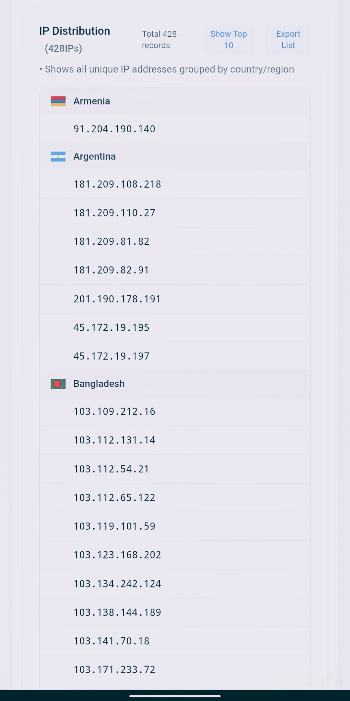

<h1 align="center">⚡ Proxy HTTP Scraper </h1>

<p align="center">
  High-performance HTTP proxy scraper built with Python.
</p>

<p align="center">
  
  
  
</p>

---

## 🖼 Preview

<p align="center">
  

  
  
</p>

---

## 🚀 Features

- ⚡ Multi-source proxy scraping  
- 📦 Automatic deduplication  
- 🎨 Clean colored CLI interface  
- 📁 Custom output filename  
- 📂 Custom output directory  
- 🧠 Smart path resolver (`$HOME`, `~`, etc.)

---

## 🌐 Records
 - 📑 Average total proxy 3000
 - ✅ Average proxy success 400

---

## 📥 Installation

```bash
https://github.com/ruiixvolthacked/ppS.git
cd proxy-scraper
